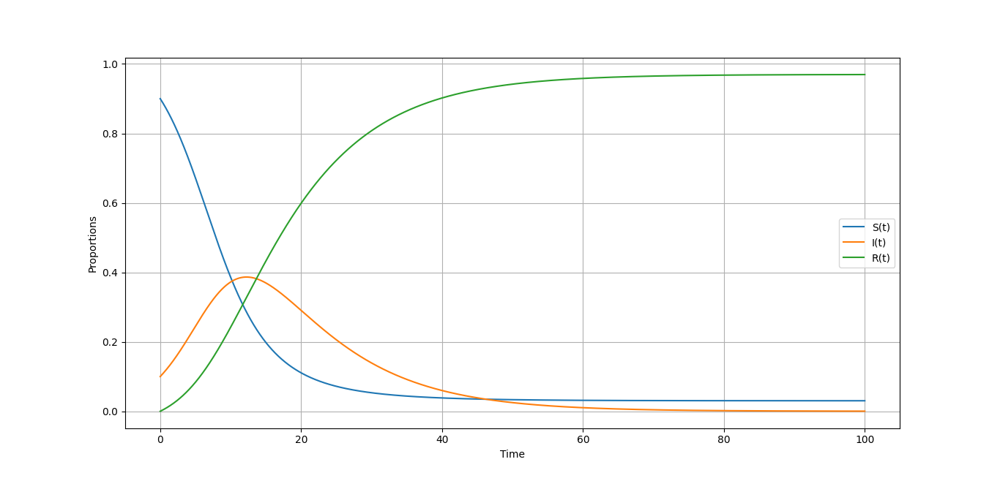

# Modelled Measles Using SIR Model
Visualization of epidemic (Measles) using SIR Model

S-I-R Model:

S compartment consists of population who are vulnerable to the disease(Decreases over time)

I compartment consiste of population of Infected people(Increases at first but later decreases)

R compartment consists of recovered population(Increases over time)

# Libraries used
numpy,
Matplotlib,
Scipy

# Flow of Population in different Compartments

